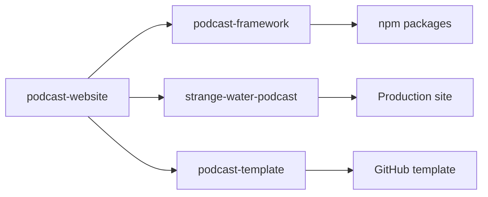

# Templatization Plan - Critical Addendum

**Date:** 2025-10-14 (Session 20)
**Purpose:** Address critical gaps in templatization plan regarding services, migration, and CMS architecture
**Status:** Supplement to main templatization-plan.md

---

## 1. Third-Party Services Architecture

### 1.1 Service Categories & Requirements

**Category A: Per-Podcast Services (Each podcast needs its own account)**

| Service | Purpose | Account Requirement | Cost Model | Setup Time |
|---------|---------|-------------------|------------|------------|
| **Sanity CMS** | Content Management | Separate project per podcast | Free tier: 3 users, 100K API calls/month<br>Paid: $99/month+ | 30 mins |
| **Google Analytics** | Traffic analytics | Separate property per domain | Free (with limits) | 15 mins |
| **ConvertKit/Mailchimp** | Newsletter | Separate account or lists | Free: 1000 subscribers<br>Paid: $15-30/month | 30 mins |
| **Cloudflare Pages** | Hosting | Separate project per site | Free: unlimited sites<br>Custom domains free | 20 mins |
| **Domain Registration** | Custom domain | One per podcast | $10-15/year | Variable |
| **Email (SMTP)** | Transactional emails | Can share with sub-accounts | $10-35/month | 30 mins |
| **Spotify for Podcasters** | Podcast hosting | One per podcast | Free | 1 hour |
| **Apple Podcasts Connect** | Distribution | One per podcast | Free | 2 hours |
| **RSS Hosting** | Feed hosting | One per podcast | Varies | 30 mins |

**Category B: Shared Services (Can be shared with API keys/sub-accounts)**

| Service | Purpose | Sharing Method | Cost Model | Configuration |
|---------|---------|---------------|------------|--------------|
| **OpenAI API** | Transcript generation | Shared API key, track usage | Pay per use: ~$0.36/episode | API key in env |
| **AssemblyAI** | Alternative transcripts | Shared API key | Pay per use: ~$0.15-0.65/hour | API key in env |
| **GitHub** | Code repository | Organization with multiple repos | Free for public<br>$4/user/month private | Repo permissions |
| **npm** | Package registry | Organization scope | Free for public | Scope access |
| **Sentry** | Error tracking | Projects within organization | Free: 5K errors/month<br>Paid: $26+/month | DSN per project |
| **Cloudinary/Uploadcare** | Image CDN | Folders/projects in one account | Free: 25GB<br>Paid: $89+/month | Folder structure |

**Category C: Development Services (Shared across all projects)**

| Service | Purpose | Sharing Method | Cost Model |
|---------|---------|---------------|------------|
| **GitHub Actions** | CI/CD | Organization-level | Free: 2000 mins/month |
| **Dependabot** | Security updates | Repo-level config | Free |
| **Vercel** | Preview deployments | Team account | Free: 100GB/month |
| **VS Code** | Development | Local installation | Free |

### 1.2 Service Configuration Strategy

```javascript
// podcast.config.js - Service Configuration
export default {
  services: {
    // Per-Podcast Services (require individual setup)
    cms: {
      provider: 'sanity',
      projectId: process.env.SANITY_PROJECT_ID,  // Unique per podcast
      dataset: process.env.SANITY_DATASET,
      // Instructions: "Create new Sanity project at sanity.io/manage"
    },

    analytics: {
      provider: 'google',
      measurementId: process.env.GA_MEASUREMENT_ID,  // Unique per podcast
      // Instructions: "Create property at analytics.google.com"
    },

    hosting: {
      provider: 'cloudflare-pages',
      projectName: 'my-podcast',  // Unique project name
      accountId: process.env.CLOUDFLARE_ACCOUNT_ID,  // Can be shared
      // Instructions: "Create project at dash.cloudflare.com/pages"
    },

    newsletter: {
      provider: 'convertkit',
      apiKey: process.env.CONVERTKIT_API_KEY,  // Unique per podcast
      formId: process.env.CONVERTKIT_FORM_ID,  // Unique per podcast
      // Instructions: "Create account at convertkit.com"
    },

    // Shared Services (can use organization account)
    transcripts: {
      provider: 'openai',
      apiKey: process.env.OPENAI_API_KEY,  // Can be shared
      model: 'whisper-1',
      // Usage tracked per podcast via metadata
    },

    monitoring: {
      provider: 'sentry',
      dsn: process.env.SENTRY_DSN,  // Unique per project
      organization: 'podcast-network',  // Shared org
      project: 'my-podcast',  // Unique project name
    },

    images: {
      provider: 'cloudinary',
      cloudName: process.env.CLOUDINARY_CLOUD_NAME,  // Shared
      folder: 'my-podcast',  // Unique folder per podcast
      apiKey: process.env.CLOUDINARY_API_KEY,  // Shared
    }
  }
}
```

### 1.3 Service Setup Automation

```bash
#!/bin/bash
# scripts/setup-services.sh

echo "🎙️ Podcast Service Setup Wizard"
echo "================================"

# 1. Sanity CMS Setup
echo "📝 Setting up Sanity CMS..."
npx sanity init --project-name "$PODCAST_NAME" \
  --dataset production \
  --template podcast-framework

# 2. Google Analytics Setup
echo "📊 Google Analytics Setup Required:"
echo "1. Go to https://analytics.google.com"
echo "2. Create new property for: $PODCAST_DOMAIN"
echo "3. Copy Measurement ID (G-XXXXXXXXXX)"
read -p "Enter Measurement ID: " GA_ID

# 3. Cloudflare Pages Setup
echo "☁️ Setting up Cloudflare Pages..."
npx wrangler pages project create "$PODCAST_SLUG" \
  --production-branch main

# 4. Newsletter Setup (if enabled)
if [ "$ENABLE_NEWSLETTER" = "true" ]; then
  echo "📧 Newsletter Setup Required:"
  echo "1. Create account at convertkit.com"
  echo "2. Create form for newsletter signup"
  echo "3. Get API credentials"
  read -p "Enter API Key: " CONVERTKIT_KEY
  read -p "Enter Form ID: " CONVERTKIT_FORM
fi

# 5. Generate .env file
cat > .env.local << EOF
# CMS (Per-Podcast)
SANITY_PROJECT_ID=$SANITY_ID
SANITY_DATASET=production
SANITY_TOKEN=$SANITY_TOKEN

# Analytics (Per-Podcast)
GA_MEASUREMENT_ID=$GA_ID

# Hosting (Per-Podcast)
CLOUDFLARE_ACCOUNT_ID=$CF_ACCOUNT
CLOUDFLARE_API_TOKEN=$CF_TOKEN

# Newsletter (Per-Podcast)
CONVERTKIT_API_KEY=$CONVERTKIT_KEY
CONVERTKIT_FORM_ID=$CONVERTKIT_FORM

# Transcripts (Shared)
OPENAI_API_KEY=$SHARED_OPENAI_KEY

# Monitoring (Shared Org, Unique Project)
SENTRY_DSN=$SENTRY_DSN
EOF

echo "✅ Service setup complete!"
```

### 1.4 Cost Analysis Per Podcast

**Minimum Viable Podcast (Free Tier)**
- Sanity CMS: $0 (free tier)
- Cloudflare Pages: $0
- Google Analytics: $0
- Domain: $12/year
- **Total: ~$1/month**

**Professional Podcast**
- Sanity CMS: $99/month (team plan)
- Cloudflare Pages: $0
- Google Analytics: $0
- ConvertKit: $30/month (1000+ subscribers)
- Domain: $12/year
- Transcripts: ~$10/month (25 episodes)
- Email (Sendgrid): $20/month
- **Total: ~$160/month**

**Enterprise Podcast**
- Sanity CMS: $499/month (enterprise)
- Cloudflare Pages: $40/month (advanced features)
- Analytics (Custom): $150/month
- Newsletter (Advanced): $100/month
- Multiple domains: $50/year
- Transcripts: $50/month
- CDN/Storage: $100/month
- **Total: ~$940/month**

---

## 2. Strange Water Repository Migration Strategy

### 2.1 Current State Analysis

```
podcast-website/ (current repository)
├── src/                    # Mixed: Framework + Strange Water specific
│   ├── components/        # 90% framework, 10% custom
│   ├── pages/            # 70% framework, 30% custom
│   ├── layouts/          # 95% framework
│   └── lib/              # 95% framework
├── public/               # Strange Water specific assets
├── sanity/               # Mixed: Base schema + Strange Water content
├── scripts/              # Mixed: Generic + Strange Water specific
└── context/              # Strange Water specific documentation
```

### 2.2 Migration Strategy: "Progressive Separation"

**Phase 1: In-Place Refactoring (Week 1)**
```bash
# Current repo structure
podcast-website/
├── packages/
│   ├── framework/        # NEW: Extract framework code
│   │   ├── components/
│   │   ├── layouts/
│   │   ├── lib/
│   │   └── package.json
│   └── cli/             # NEW: CLI tools
│
├── sites/
│   └── strange-water/   # NEW: Move SW-specific code
│       ├── src/
│       │   ├── pages/   # Custom pages only
│       │   └── components/ # Custom components only
│       ├── public/      # SW assets
│       ├── content/     # SW content/context
│       └── podcast.config.js
│
└── template/            # NEW: Clean template for new podcasts
    ├── src/
    ├── public/
    └── podcast.config.js
```

**Phase 2: Repository Split (Week 2)**



**Step-by-Step Migration:**

```bash
#!/bin/bash
# migration-script.sh

# 1. Create framework package
echo "📦 Extracting framework code..."
mkdir -p packages/framework
cp -r src/components packages/framework/
cp -r src/layouts packages/framework/
cp -r src/lib packages/framework/

# 2. Update imports in framework
echo "🔄 Updating framework imports..."
find packages/framework -name "*.astro" -o -name "*.ts" | \
  xargs sed -i 's|../../|@podcast-framework/core/|g'

# 3. Create Strange Water site
echo "🎙️ Creating Strange Water site..."
mkdir -p sites/strange-water
mv public sites/strange-water/
mv context sites/strange-water/
cp -r src/pages sites/strange-water/src/

# 4. Create clean template
echo "📋 Creating clean template..."
cp -r packages/framework/components template/src/
cp -r packages/framework/layouts template/src/
cp template-assets/* template/public/

# 5. Update package.json for workspaces
cat > package.json << 'EOF'
{
  "name": "podcast-framework-monorepo",
  "private": true,
  "workspaces": [
    "packages/*",
    "sites/*",
    "template"
  ],
  "scripts": {
    "dev:sw": "npm run dev --workspace=sites/strange-water",
    "dev:template": "npm run dev --workspace=template",
    "build:packages": "npm run build --workspace=packages/framework",
    "test": "npm run test --workspaces"
  }
}
EOF

# 6. Create new repos and push
echo "🚀 Creating new repositories..."
git subtree push --prefix=packages/framework origin framework
git subtree push --prefix=sites/strange-water origin strange-water
git subtree push --prefix=template origin template
```

### 2.3 Maintaining Strange Water During Migration

**Dual-Mode Operation:**
```javascript
// astro.config.mjs
import { defineConfig } from 'astro/config';

const isStangeWater = process.env.SITE === 'strange-water';
const isFrameworkDev = process.env.MODE === 'framework-dev';

export default defineConfig({
  srcDir: isStangeWater ? './sites/strange-water/src' : './src',
  publicDir: isStangeWater ? './sites/strange-water/public' : './public',

  vite: {
    resolve: {
      alias: {
        '@framework': isFrameworkDev
          ? './packages/framework/src'
          : '@podcast-framework/core'
      }
    }
  }
});
```

**Continuous Deployment During Migration:**
```yaml
# .github/workflows/deploy-strange-water.yml
name: Deploy Strange Water
on:
  push:
    branches: [main]
    paths:
      - 'sites/strange-water/**'
      - 'packages/framework/**'

jobs:
  deploy:
    runs-on: ubuntu-latest
    steps:
      - uses: actions/checkout@v3
      - run: npm ci
      - run: npm run build:framework
      - run: npm run build --workspace=sites/strange-water
      - uses: cloudflare/pages-action@v1
        with:
          projectName: strange-water
          directory: sites/strange-water/dist
```

### 2.4 Migration Timeline

**Week 1: Preparation**
- Day 1-2: Inventory Strange Water customizations
- Day 3-4: Create framework package structure
- Day 5: Test framework extraction locally

**Week 2: Separation**
- Day 1-2: Move framework code to packages/
- Day 3: Update Strange Water imports
- Day 4: Create template structure
- Day 5: Test both Strange Water and template

**Week 3: Repository Split**
- Day 1: Create new GitHub repositories
- Day 2: Configure CI/CD for each repo
- Day 3: Deploy Strange Water from new structure
- Day 4: Publish framework to npm
- Day 5: Documentation and cleanup

**Week 4: Validation**
- Test Strange Water production site
- Deploy test podcast from template
- Verify upgrade path
- Document lessons learned

---

## 3. Sanity CMS Architecture

### 3.1 CMS Model: One Project Per Podcast

**Why Separate Projects?**
1. **Data Isolation:** Each podcast's content is completely separate
2. **Billing Clarity:** Each podcast has its own usage/billing
3. **Access Control:** Different teams per podcast
4. **Customization:** Schema can evolve independently
5. **Performance:** No cross-podcast query overhead
6. **Compliance:** Data residency requirements

**Sanity Project Structure:**
```
Sanity Organization (podcast-framework)
├── strange-water (Project)
│   ├── Datasets
│   │   ├── production
│   │   └── development
│   ├── Team Members
│   │   ├── rex@example.com (admin)
│   │   └── editor@example.com (editor)
│   └── API Tokens
│       ├── read-token (public)
│       └── write-token (server)
│
├── tech-talks (Project)
│   ├── Datasets
│   │   └── production
│   └── Team Members
│       └── owner@techtalks.com
│
└── my-new-podcast (Project)
    └── [Similar structure]
```

### 3.2 Schema Management Strategy

**Base Schema Package:**
```javascript
// packages/sanity-schema/index.js
export const baseSchemas = {
  episode: {
    name: 'episode',
    title: 'Episode',
    type: 'document',
    fields: [
      // Core fields that all podcasts need
      {name: 'title', type: 'string', required: true},
      {name: 'episodeNumber', type: 'number', required: true},
      {name: 'publishDate', type: 'datetime', required: true},
      {name: 'description', type: 'text'},
      {name: 'duration', type: 'string'},
      // ... other standard fields
    ]
  },

  guest: {
    name: 'guest',
    title: 'Guest',
    type: 'document',
    fields: [
      {name: 'name', type: 'string', required: true},
      {name: 'bio', type: 'text'},
      {name: 'photo', type: 'image'},
      // ... other standard fields
    ]
  },

  theme: {
    // Theme configuration schema
  },

  contribution: {
    // User contribution schema
  }
};

// Allow schema extension
export function extendSchema(baseSchema, customFields) {
  return {
    ...baseSchema,
    fields: [...baseSchema.fields, ...customFields]
  };
}
```

**Per-Podcast Schema Customization:**
```javascript
// sites/my-podcast/sanity/schemas/episode.js
import { baseSchemas, extendSchema } from '@podcast-framework/sanity-schema';

export default extendSchema(baseSchemas.episode, [
  // Custom fields for this specific podcast
  {
    name: 'sponsor',
    title: 'Episode Sponsor',
    type: 'reference',
    to: [{type: 'sponsor'}]
  },
  {
    name: 'videoUrl',
    title: 'YouTube Video URL',
    type: 'url'
  }
]);
```

### 3.3 Sanity Setup Automation

```javascript
// packages/cli/commands/setup-cms.js
import { createClient } from '@sanity/client';
import { deploySchema } from '../lib/sanity-deploy';

export async function setupCMS(podcastName, options) {
  console.log('🎨 Setting up Sanity CMS...');

  // 1. Create new Sanity project via API
  const project = await createSanityProject({
    title: podcastName,
    organizationId: process.env.SANITY_ORG_ID
  });

  // 2. Create dataset
  await createDataset(project.id, 'production');

  // 3. Deploy base schema
  await deploySchema({
    projectId: project.id,
    dataset: 'production',
    schemas: baseSchemas
  });

  // 4. Create API tokens
  const tokens = await createTokens(project.id);

  // 5. Configure CORS
  await configureCORS(project.id, [
    'http://localhost:4321',
    `https://${podcastName}.pages.dev`,
    options.customDomain
  ]);

  // 6. Import sample data (optional)
  if (options.includeSampleData) {
    await importSampleData(project.id);
  }

  return {
    projectId: project.id,
    readToken: tokens.read,
    writeToken: tokens.write,
    studioUrl: `https://${project.id}.sanity.studio`
  };
}
```

### 3.4 Data Migration Between CMS Instances

```javascript
// packages/cli/commands/migrate-content.js
export async function migrateContent(source, target) {
  const sourceClient = createClient({
    projectId: source.projectId,
    dataset: source.dataset,
    token: source.token
  });

  const targetClient = createClient({
    projectId: target.projectId,
    dataset: target.dataset,
    token: target.token
  });

  // 1. Export all documents
  const documents = await sourceClient.fetch('*[]');

  // 2. Transform if needed
  const transformed = documents.map(doc => ({
    ...doc,
    _id: doc._id.replace(source.projectId, target.projectId)
  }));

  // 3. Import to target
  for (const doc of transformed) {
    await targetClient.createOrReplace(doc);
  }

  console.log(`✅ Migrated ${documents.length} documents`);
}
```

### 3.5 CMS Costs Per Podcast

**Sanity Pricing Tiers:**

| Tier | Users | API Requests | Asset Storage | Cost |
|------|-------|--------------|---------------|------|
| **Free** | 3 | 100K/month | 1GB | $0 |
| **Team** | 10 | 1M/month | 10GB | $99/month |
| **Business** | 20 | 10M/month | 100GB | $499/month |
| **Enterprise** | Unlimited | Unlimited | Custom | Custom |

**Usage Estimates per Podcast:**
- **Small Podcast** (10 episodes/year): ~20K requests/month → Free tier
- **Medium Podcast** (50 episodes/year): ~200K requests/month → Team tier
- **Large Podcast** (200+ episodes): ~2M requests/month → Business tier

### 3.6 Multi-Podcast Management Dashboard

```javascript
// packages/dashboard/pages/podcasts.jsx
export function PodcastsDashboard() {
  const podcasts = [
    {
      name: 'Strange Water',
      projectId: 'abc123',
      status: 'active',
      episodes: 69,
      lastPublished: '2024-03-15',
      monthlyViews: 15000,
      cmsUsage: '45K/100K requests'
    },
    {
      name: 'Tech Talks',
      projectId: 'def456',
      status: 'active',
      episodes: 23,
      lastPublished: '2025-01-10',
      monthlyViews: 8000,
      cmsUsage: '22K/100K requests'
    }
  ];

  return (
    <Dashboard>
      <h1>Podcast Network Overview</h1>
      <PodcastGrid podcasts={podcasts} />
      <UsageChart />
      <CostBreakdown />
    </Dashboard>
  );
}
```

---

## 4. Summary of Critical Decisions

### Service Architecture Decisions
1. **Sanity CMS:** One project per podcast (data isolation, billing clarity)
2. **Hosting:** Separate Cloudflare Pages project per podcast
3. **Analytics:** Individual GA properties per domain
4. **Newsletter:** Separate accounts or sub-lists per podcast
5. **Transcripts:** Shared API keys with usage tracking

### Migration Decisions
1. **Strategy:** Progressive separation over 4 weeks
2. **Strange Water:** Remains functional throughout migration
3. **Repository:** Monorepo → 3 separate repos
4. **Deployment:** Continuous throughout migration

### Cost Implications
- **Per Podcast:** $0-160/month depending on tier
- **Shared Services:** ~$50-100/month for all podcasts
- **Development:** One-time setup cost

### Next Steps
1. **Inventory** Strange Water customizations (2 days)
2. **Setup** test Sanity project (1 day)
3. **Begin** progressive separation (Week 1)
4. **Document** service setup process (ongoing)

---

**Document Created:** 2025-10-14 (Session 20)
**Purpose:** Address critical service, migration, and CMS questions
**Status:** Ready for review and integration with main plan